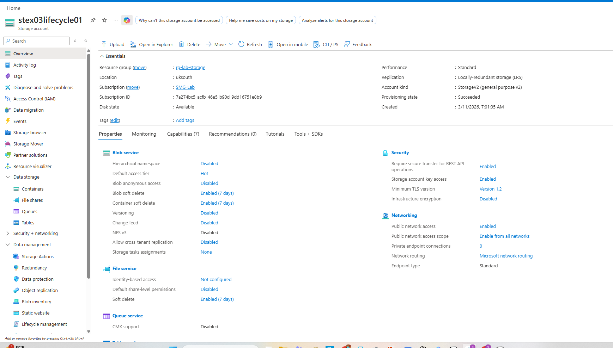
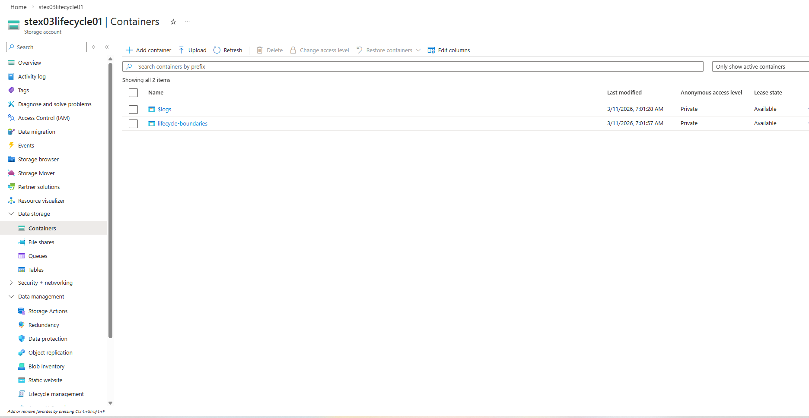
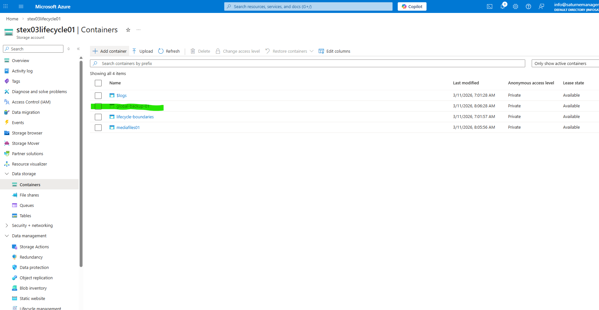
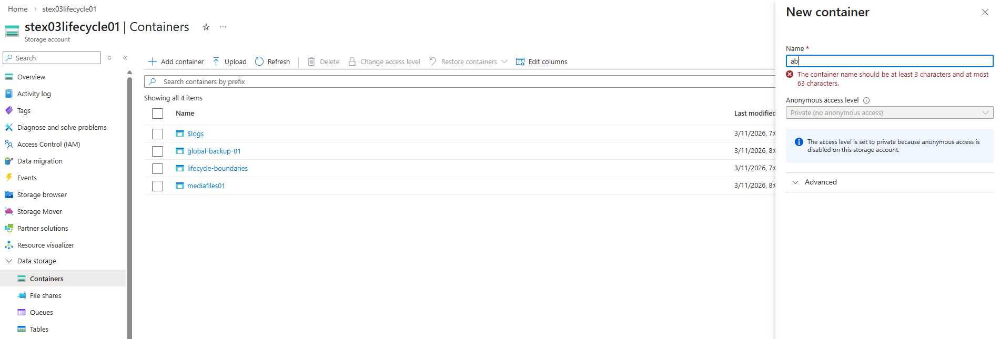
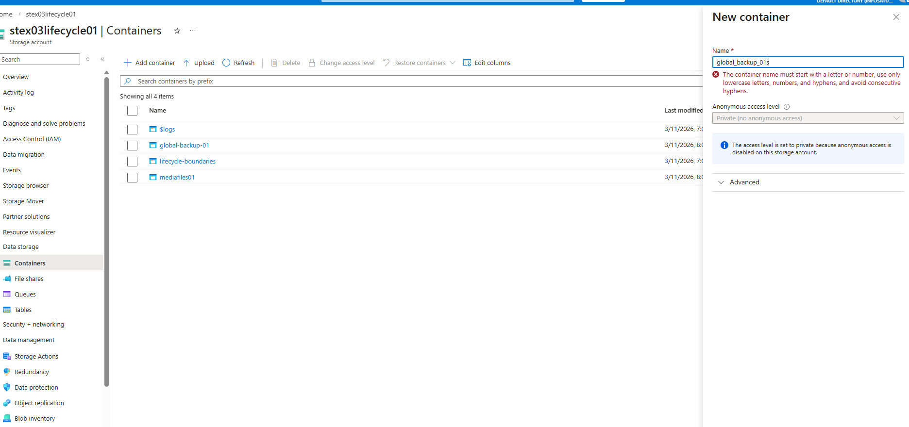
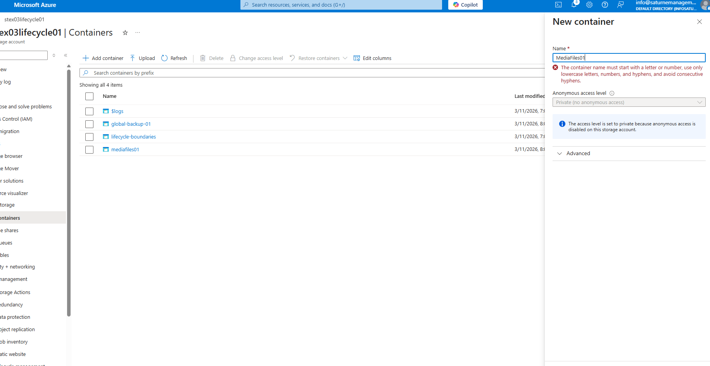

# EX04 — Naming & Limits Discipline (Azure Blob Containers)

## Purpose

The purpose of this lab was to understand and validate **Azure Blob container naming rules** by intentionally creating both valid and invalid container names. Rather than only creating successful resources, this exercise focused on observing how Azure enforces platform constraints when naming rules are violated.

Container naming discipline is important because storage resources are frequently provisioned through **automation tools such as Bicep, ARM templates, Terraform, or CI/CD pipelines**. If naming standards are not followed, deployments will fail immediately. Engineers must understand these restrictions to avoid operational failures in automated environments.

This exercise strengthens **precision recall**, reinforces platform behavior, and builds familiarity with Azure storage naming enforcement.

---

## Lab Environment

**Storage Account**

```
stex03lifecycle01
```

**Resource Group**

```
rg-lab-storage
```

**Region**

```
UK South
```

**Platform**

```
Microsoft Azure Portal
```

---

## Storage Account Overview

The storage account used for this exercise was an existing lab storage account.



---

## Containers — Starting State

Before beginning the naming tests, the storage account already contained two containers:

- `$logs`
- `lifecycle-boundaries`

The `$logs` container is automatically created by Azure for storage analytics logging. System containers such as `$logs` and `$web` may not follow normal naming conventions because they are **platform-managed resources**.



---

## Azure Blob Container Naming Rules

Azure enforces the following rules when creating container names:

- Must be **3–63 characters**
- Must use **lowercase letters only**
- May include **numbers**
- May include **hyphens (-)**
- Must **start with a letter or number**
- **Uppercase letters are not allowed**
- **Underscores are not allowed**
- **Special characters are not allowed**

These rules exist because container names form part of a **DNS-compliant storage endpoint**.

Example:

```
https://<storageaccount>.blob.core.windows.net/<container>
```

---

## Valid Container Naming Tests

Two containers were successfully created using valid naming patterns.

### Container 1

```
mediafiles01
```

### Container 2

```
global-backup-01
```

Both container names meet Azure naming requirements:

- lowercase characters
- valid character length
- numbers allowed
- hyphen usage allowed



---

## Invalid Naming Tests

Three invalid naming scenarios were intentionally tested to observe Azure validation behavior.

---

### Invalid Test 1 — Name Too Short

```
ab
```

Azure rejected this name because it does not meet the **minimum 3-character requirement**.



---

### Invalid Test 2 — Underscore Character

```
global_backup_01
```

Azure rejected this name because **underscores are not permitted** in container names.



---

### Invalid Test 3 — Uppercase Letters

```
MediaFiles01
```

Azure rejected this name because container names **must be lowercase only**.



---

## Outcome

This exercise confirmed how Azure enforces strict naming validation for Blob containers.

The Azure portal prevents invalid names from being created by validating container names against the platform's naming rules before deployment.

Both valid containers were created successfully, while invalid naming attempts were blocked with specific validation messages.

---

## Key Takeaways

### Naming Discipline is Critical

Storage containers are frequently referenced by:

- applications
- automation scripts
- CI/CD pipelines
- infrastructure-as-code templates

Incorrect naming will cause deployments to fail.

---

### Azure Uses DNS-Compatible Naming Standards

Container naming rules exist to ensure compatibility with:

- DNS resolution
- REST API endpoints
- storage service architecture

---

### Engineers Must Understand Platform Validation

Knowing **why a resource fails to deploy** is just as important as knowing how to create it successfully.

Capturing validation errors builds stronger troubleshooting skills and improves familiarity with platform constraints.

---

## Real-World Relevance

In enterprise cloud environments, storage containers are used for:

- application data storage
- backup repositories
- logging and monitoring pipelines
- media or static content delivery
- archival data retention

Organizations enforce strict naming standards to maintain:

- automation consistency
- operational clarity
- predictable infrastructure deployments

Strong naming discipline is a foundational skill for **cloud infrastructure engineers and platform teams**.
